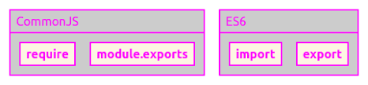
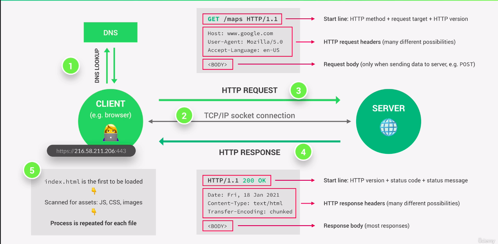
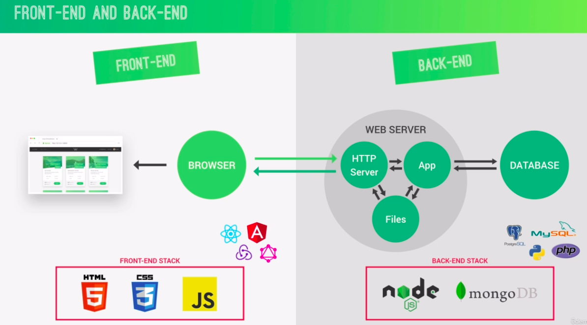

# Backend Notes
NodeJs, Express &amp; MongoDB Bootcamp notes.

## Part 1: Node.JS Basics

### Section 1: Introduction

- code along
- coding challenges
- take notes
- Q & A

### Section 2: Introduction to Node.js and NPM

+ Node.js => a js runtime built on googles open source v8 js engine.
+ so we can run our code outside of browser.
+ v8 engine run the code.
+ so we can access to file sytem with nodejs. We couldnt do that on browser.

=> so it is perfect to use Node.js as a web server
=> meaning: we can finally use js on the server side of the web development in order to build fast highly scalable network applications.

**pros**
+ single threaded, event driven, non blocking
+ perfect for building fast and scalable data intensive apps
+ many good companies use node.js (netflix, uber, paypal)
+ same language full stack - so it is fast and efficient
+ huge library of open source packages (NPM)
+ very active developer community

**use for**
+ API with databasem(preferably NoSQL)
+ data streaming
+ real time chat app
+ server side web apps

**not good for**
+ apps with super heavy server side processing, file compression etc => for these php, python, rails

**Notes:**
+ you can use ES6 or older, any JS will work.Because we dont run js on browser, but on server. We running it inside node app.
+ write node on terminal, it starts node, when you hit tab it shows u all global variables.
+ "_" it means your previous result!
+ String. + tab => shows u all related methods/constructors and so on

**Modules**
+ all kinds of additional functionality are stored in module.
+ reading files ability is inside fs module.
```JavaScript
const fs = require("fs");
```
+ so we get address to functions related with file system
+ we call it with require and it returns an object with functions
+ and we stored this object into fs variable
+ so we can use it later

[Node Documentation](https://nodejs.org/en/docs/)

```JavaScript
const textIn = fs.readFileSync("./txt/input.txt", "utf-8");
//syncronous way of file reading there is also async version
//two arguments => path to file, and second one character encoding(usually utf-8)
console.log(textIn);

fs.writeFileSync("./txt/output.txt", textOut);
//first argument is path, second one the thing we want to write
```
**sync - async code**

+ processing one by one, each one waits the result of previous one
+ so it is blocking code
+ this is a problem
+ as solution used async nonblocking codes
+ in async, we have a callback funtion to handle the result when the process is done
+ so the codes are not blocked by the heavy tasks run in the background

```JavaScript
const fs = require("fs");
fs.readFile("input.txt", "utf-8", (err, data) => {
  console.log(data);
 });
 console.log("Reading file...");
 //first it sees readFile, it is async code, so while it is processes in the background it goes down and prints reading file and then data.
 + here the third argument our function takes is a callback to process result when it is ready.
 ```
 + single thread: there is only one signle thread. the thread is where our code actually executed in machines processor. All the users using same thread.
 + always same place for all users. So one user need to wait others to go on.
 + so async code we use for dealing with heavy work in the background! Time consuming tasks should be executed here.
 + non blocking I/O model => input output
 + this is why we use so many callback functions in Node.js / for example in php it is very different concept!
 + callbacks are not automatically async!
 + the problem is callback hell! nested callbacks can be very confusing. this triangular shape is a sign that you are in a callback hell.
 + how can we escape callback hell? => using promises or async / await (more elegant way)
 
 **note**: arrow function doesnt have its own this keyword, uses the parents this keyword / lexical scope we call it. normal function has its own scope, own this keyword.
 
 **Creating a simple web server**
 
 + we need another package calles http. IT gives us networking capability.
 
 
```JavaScript
const server = http.createServer((req, res) => {
    // console.log(req);
    res.end("Hello from the server!")
});
// server is the result ot createSERver method
// createServer takes a callback function, will be fired each time a request to a server,
//this callback has access to fundamental variables, request and response variable.
//each time the server gets request, this response will be called,
//these two are objects, inside we have useful tools to deal with request and response
//.end is the simplest way to send a simple response

server.listen(8000, "127.0.0.1", () => {
    console.log("Listening to requests on port 8000");
})

//local host simply means the current computer, "127.0.0.1" is the standard IP address for it.
//due to event loop, it(server that we created) doesnt exits from app, 
//because the whole goal is the waiting for requests, this is the point about server
//when we write http://127.0.0.1:8000/ to the browser we see the response from server
 ```
 
 **Routing**
 
 + host/port/urlname
 + implementing different actions for different url => routing
 + for routing we need "url" modul.
 ```JavaScript
 const url = require("url");
 ```
 + browser automatically request for websites icon (fav icon)
 + http header => is  a piece of info we are sending back from server
 + we can use it to send some metadata for errors:
  ```JavaScript
const server = http.createServer((req, res) => {
    const pathName =  req.url;
    if(pathName === "/" || pathName === "/overview"){
        res.end("This is the overview")
    }else if(pathName === "/product"){
        res.end("This is the product")
    }else{
        res.writeHead(404, {
            "Content-type" : "text/html",
            "my-own-header":"hello-world"
        });
        res.end("<h1>Page not found</h1>")
    }
});
 ```
 
 **API**
 
 + a service from which you can request some data.
 + JSON is a very simple text format similar to JS format.
 + using dirname variable is better practice instead of using . (dot) for the current directory in the paths inside methods.
 + because usually . (dot) means where your script is working and __dir means where the current file is located.
 => __dirname is path of the directory that contains current file ( the file inside which you are writing __dirname)
 => ./ refers to the path of directory where terminal is opened.
 ```JavaScript
 else if(pathName === "/api"){
        fs.readFile(`${__dirname}/dev-data/data.json`, ...)
        res.end("API");
 ```
 + one exception about meaning / usage of dot is : require function! 
 + JSON.parse() => parse() The JSON. parse() method parses a JSON string, constructing the JavaScript value or object described by the string. Parses into an object.
 + sync / top-level code only executes once but async code / callback will executed each time there is a request!
 + it is important to understand which code will executed once in the beginning and which one will executed again and again.
 ```JavaScript
 const data = fs.readFileSync(`${__dirname}/dev-data/data.json`, "utf-8");
const dataObj = JSON.parse(data);
//parses this into an object

const server = http.createServer((req, res) => {
    const pathName =  req.url;
    if(pathName === "/" || pathName === "/overview"){
        res.end("This is the overview");
    }else if(pathName === "/product"){
        res.end("This is the product");
    }else if(pathName === "/api"){
            res.writeHead(200, {"Content-type": "application/json"});
            res.end(data);
    }else{
        res.writeHead(404, {
            "Content-type" : "text/html",
            "my-own-header":"hello-world"
        });
        res.end("<h1>Page not found</h1>")
    }
});
```

+ use reqular expressions instead of quotes here, because it only replaces first one if you use quotes. but regular expressions with /g replaces all.
```JavaScript
const replaceTemplate = (temp, product) => {
    let output = temp.replace(/{%PRODUCTNAME}/g, product.productName)
}
```

**difference between import and require:** You can't selectively load only the pieces you need with require but with import, you can selectively load only the pieces you need, which can save memory. But thanks to last updates we can use destructuring with require. So we can select the pieces we want.

Another major difference is you can use require anywhere in the program where as import should always be at the top of file.

Loading is synchronous(step by step) for require on the other hand import can be asynchronous(without waiting for previous import) so it can perform a little better than require.



[named export vs default export](https://medium.com/@etherealm/named-export-vs-default-export-in-es6-affb483a0910)

"
Named exports are useful to export several values. During the import, one will be able to use the same name to refer to the corresponding value.
Concerning the default export, there is only a single default export per module. A default export can be a function, a class, an object or anything else. This value is to be considered as the “main” exported value since it will be the simplest to import.
"

**Node.js process.argv Property:**
The process.argv property is an inbuilt application programming interface of the process module which is used to get the arguments passed to the node.js process when run in the command line.
Syntax: process.argv
Return Value: This property returns an array containing the arguments passed to the process when run it in the command line. The first element is the process execution path and the second element is the path for the js file.

```JavaScript
//command line 
node index.js extra_argument1 extra_argument2 3

//output
number of arguments is 5
0: C:\Program Files\nodejs\node.exe
1: C:\nodejs\g\process\argv_2.js
2: extra_argument1
3: extra_argument2
4: 3
```

**difference between import & require**
There are two mainly used module system syntaxs.
1. CommonJS
2. ES6 module syntax
Nodejs uses commonJS module syntax by default...
const express = require("express")
But it can support es6 module systax as well by just adding type property in package json and set value of type to module.
ES6 syntax
Import express from "express"
The functionality will keep the same ,difference is only syntax
Browser supports ES6 module systax only.
Import sum from "./sum.js"
And you can import only what you need.
ES6 syntax:
```JavaScript
Import {NavLink} from "react-router-dom"
```
CommonJS syntax:
```JavaScript
const { exec} = require("child-process")
```
The major difference in commonjs and ES module is of synchronous and asynchronous nature>> -commonjs modules are synchronous, this is'nt an issue in case of small module execution but in case of large modules it can be delay to process. while, -loading and parsing of ES modules is asynchronous, this is the difference where may be the performance gets vary.
Nowadays all new modules built on Es6 module.

**NPM:** is a command line interface app, that automatically comes with installed node.js; we use to install and manage open source packages. Both app and repository is npm.

[express](https://www.npmjs.com/package/express) => node framework

npm init =>  creates a package.json file, project related data inside;
name => package name
version => version of project
description and so on, it asks project related questions
if you dont want to answer all, you can write "npm init -y"

+ there are two types of packages we can install: simple/regular dependencies or development dependencies(debugging tool, webpack...).

npm install slugify (it installs this package as regular dependency)
npm install nodemon --save-dev (it installs this package as development dependency) // or -D for --save-dev and -g for --global
so we install these to our local => inside node_modules file

we can also have global installs, inside whole maachine
for example we can install and use nodemon as global dependency:
npm i nodemon --global => installs nodemon globally
(if you work on Mac, you need to add sudo in the beginning of command)

+ for executing locally installed dependencies we need script.
```JavaScript
 "scripts": {
    "start": "nodemon index.js"
  },
 ```
 npm (run) start (terminal command)
 
+ usually we install development dependencies globally, regular ones locally!

+ versions: 1.18.11 => major-version.minor-version.patch-version; patch version is for bug fixing. minor version introduces some new features but not includes a breaking change. It doesnt break our code. Major version is a huge new release and it can have breaking changes, our code might not work.

+ updates: small icons in front of version number is related with our permissions for updates: ^ this symbol specifies which updates we accept for packages, this means we accept all releases and updates minor and patch also. ~ this symbol means only accept pacth releases. * means all of the versions. Even the ones with huge changes. Usually as default we use ^ this one.

npm outdated => this command show us all outdated packages!
npm install slugify@1.0.0 => we install the specific version of slugify paackage
npm update slugify => it updates the package according to our preferences (symbol in front of version number)

+ deletes: npm uninstall package-name

+ package-lock.json file => detailed info about packages.

[adding packages to npm](https://docs.npmjs.com/packages-and-modules/contributing-packages-to-the-registry)

=> prettier: auto format - on; .prettierrc file; {"singleQuote": true, "printWidth":80 (default)}

## Part 2: How Node Works

**How web works**:
+ browser(client) send request, server send response.This is request-response model.
+ DNS => domain name server, dns convert domain name into real ip address of server.#
+ TCP => transmission control protocol, IP internet protocol
+ HTTP => hypertext transffer protocol



**Frontend and Backend**:
+ Front-End => browser side
+ Back-Emd => server side
+ Web Server => a basic server is a computer that is connected to internet. Which stores files of a websites (html, css,js), runs an http server that is capable understanding urls request and delivering responses. So using requests qnd responses it communicates the browser. This is called a static server. For simple websites all you need is this. But for more complex websites like connecting to database and so on, we use a servser which is also capable of running our dynamic applications. This is called Dynamic server. And also we need a database for dynamic websites. To store user data etc. Backend communicates with this database.
+ so inside web server => http server + app + files




### Section 3: Introduction to Back-End Web Development

### Section 4: How Node.js Works: A Look Behind the Scenes

## Optional Part

### Section 5: Asynchronous JavaScript: Promises and Async/Await

## Part 3: "Natours" API

### Section 6: Express: Starting Building the Natours API

### Section 7: Introduction to MongoDB

### Section 8: Mongoose

### Section 9: Error Handling with Express

### Section 10: Authentication, Authorization and Security

### Section 11: Modelling Data and Advanced Mongoose

## Part 4: "Natours" Site

### Section 12: Server-Side Rendering with Pug Templates

### Section 13: Advanced Features: Payments, Email, File Uploads

### Section 14: Setting Up Git and Deployment

### Last Notes
