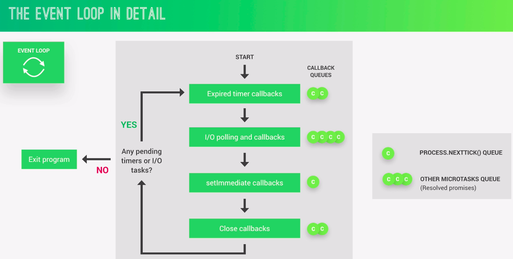
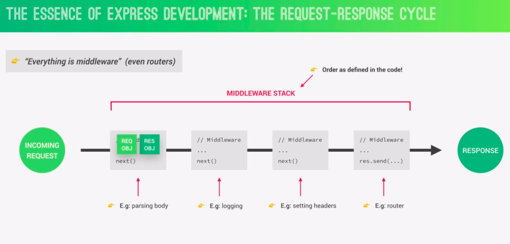

# Backend Notes

NodeJs, Express &amp; MongoDB Bootcamp notes.

## Part 1: Node.JS Basics

### Section 1: Introduction

- code along
- coding challenges
- take notes
- Q & A

### Section 2: Introduction to Node.js and NPM

- Node.js => a js runtime built on googles open source v8 js engine.
- so we can run our code outside of browser.
- v8 engine run the code.
- so we can access to file sytem with nodejs. We couldnt do that on browser.

=> so it is perfect to use Node.js as a web server
=> meaning: we can finally use js on the server side of the web development in order to build fast highly scalable network applications.

**pros**

- single threaded, event driven, non blocking
- perfect for building fast and scalable data intensive apps
- many good companies use node.js (netflix, uber, paypal)
- same language full stack - so it is fast and efficient
- huge library of open source packages (NPM)
- very active developer community

**use for**

- API with databasem(preferably NoSQL)
- data streaming
- real time chat app
- server side web apps

**not good for**

- apps with super heavy server side processing, file compression etc => for these php, python, rails

**Notes:**

- you can use ES6 or older, any JS will work.Because we dont run js on browser, but on server. We running it inside node app.
- write node on terminal, it starts node, when you hit tab it shows u all global variables.
- "\_" it means your previous result!
- String. + tab => shows u all related methods/constructors and so on

**Modules**

- all kinds of additional functionality are stored in module.
- reading files ability is inside fs module.

```JavaScript
const fs = require("fs");
```

- so we get address to functions related with file system
- we call it with require and it returns an object with functions
- and we stored this object into fs variable
- so we can use it later

[Node Documentation](https://nodejs.org/en/docs/)

```JavaScript
const textIn = fs.readFileSync("./txt/input.txt", "utf-8");
//syncronous way of file reading there is also async version
//two arguments => path to file, and second one character encoding(usually utf-8)
console.log(textIn);

fs.writeFileSync("./txt/output.txt", textOut);
//first argument is path, second one the thing we want to write
```

**sync - async code**

- processing one by one, each one waits the result of previous one
- so it is blocking code
- this is a problem
- as solution used async nonblocking codes
- in async, we have a callback funtion to handle the result when the process is done
- so the codes are not blocked by the heavy tasks run in the background

```JavaScript
const fs = require("fs");
fs.readFile("input.txt", "utf-8", (err, data) => {
  console.log(data);
 });
 console.log("Reading file...");
 //first it sees readFile, it is async code, so while it is processes in the background it goes down and prints reading file and then data.
 + here the third argument our function takes is a callback to process result when it is ready.
```

- single thread: there is only one signle thread. the thread is where our code actually executed in machines processor. All the users using same thread.
- always same place for all users. So one user need to wait others to go on.
- so async code we use for dealing with heavy work in the background! Time consuming tasks should be executed here.
- non blocking I/O model => input output
- this is why we use so many callback functions in Node.js / for example in php it is very different concept!
- callbacks are not automatically async!
- the problem is callback hell! nested callbacks can be very confusing. this triangular shape is a sign that you are in a callback hell.
- how can we escape callback hell? => using promises or async / await (more elegant way)

**note**: arrow function doesnt have its own this keyword, uses the parents this keyword / lexical scope we call it. normal function has its own scope, own this keyword.

**Creating a simple web server**

- we need another package calles http. IT gives us networking capability.

```JavaScript
const server = http.createServer((req, res) => {
    // console.log(req);
    res.end("Hello from the server!")
});
// server is the result ot createSERver method
// createServer takes a callback function, will be fired each time a request to a server,
//this callback has access to fundamental variables, request and response variable.
//each time the server gets request, this response will be called,
//these two are objects, inside we have useful tools to deal with request and response
//.end is the simplest way to send a simple response

server.listen(8000, "127.0.0.1", () => {
    console.log("Listening to requests on port 8000");
})

//local host simply means the current computer, "127.0.0.1" is the standard IP address for it.
//due to event loop, it(server that we created) doesnt exits from app,
//because the whole goal is the waiting for requests, this is the point about server
//when we write http://127.0.0.1:8000/ to the browser we see the response from server
```

**Routing**

- host/port/urlname
- implementing different actions for different url => routing
- for routing we need "url" modul.

```JavaScript
const url = require("url");
```

- browser automatically request for websites icon (fav icon)
- http header => is a piece of info we are sending back from server
- we can use it to send some metadata for errors:

```JavaScript
const server = http.createServer((req, res) => {
  const pathName =  req.url;
  if(pathName === "/" || pathName === "/overview"){
      res.end("This is the overview")
  }else if(pathName === "/product"){
      res.end("This is the product")
  }else{
      res.writeHead(404, {
          "Content-type" : "text/html",
          "my-own-header":"hello-world"
      });
      res.end("<h1>Page not found</h1>")
  }
});
```

**API**

- a service from which you can request some data.
- JSON is a very simple text format similar to JS format.
- using dirname variable is better practice instead of using . (dot) for the current directory in the paths inside methods.
- because usually . (dot) means where your script is working and **dir means where the current file is located.
  => **dirname is path of the directory that contains current file ( the file inside which you are writing \_\_dirname)
  => ./ refers to the path of directory where terminal is opened.

```JavaScript
else if(pathName === "/api"){
       fs.readFile(`${__dirname}/dev-data/data.json`, ...)
       res.end("API");
```

- one exception about meaning / usage of dot is : require function!
- JSON.parse() => parse() The JSON. parse() method parses a JSON string, constructing the JavaScript value or object described by the string. Parses into an object.
- sync / top-level code only executes once but async code / callback will executed each time there is a request!
- it is important to understand which code will executed once in the beginning and which one will executed again and again.

```JavaScript
const data = fs.readFileSync(`${__dirname}/dev-data/data.json`, "utf-8");
const dataObj = JSON.parse(data);
//parses this into an object

const server = http.createServer((req, res) => {
   const pathName =  req.url;
   if(pathName === "/" || pathName === "/overview"){
       res.end("This is the overview");
   }else if(pathName === "/product"){
       res.end("This is the product");
   }else if(pathName === "/api"){
           res.writeHead(200, {"Content-type": "application/json"});
           res.end(data);
   }else{
       res.writeHead(404, {
           "Content-type" : "text/html",
           "my-own-header":"hello-world"
       });
       res.end("<h1>Page not found</h1>")
   }
});
```

- use reqular expressions instead of quotes here, because it only replaces first one if you use quotes. but regular expressions with /g replaces all.

```JavaScript
const replaceTemplate = (temp, product) => {
    let output = temp.replace(/{%PRODUCTNAME}/g, product.productName)
}
```

**difference between import and require:** You can't selectively load only the pieces you need with require but with import, you can selectively load only the pieces you need, which can save memory. But thanks to last updates we can use destructuring with require. So we can select the pieces we want.

Another major difference is you can use require anywhere in the program where as import should always be at the top of file.

Loading is synchronous(step by step) for require on the other hand import can be asynchronous(without waiting for previous import) so it can perform a little better than require.


[named export vs default export](https://medium.com/@etherealm/named-export-vs-default-export-in-es6-affb483a0910)

"
Named exports are useful to export several values. During the import, one will be able to use the same name to refer to the corresponding value.
Concerning the default export, there is only a single default export per module. A default export can be a function, a class, an object or anything else. This value is to be considered as the “main” exported value since it will be the simplest to import.
"

**Node.js process.argv Property:**
The process.argv property is an inbuilt application programming interface of the process module which is used to get the arguments passed to the node.js process when run in the command line.
Syntax: process.argv
Return Value: This property returns an array containing the arguments passed to the process when run it in the command line. The first element is the process execution path and the second element is the path for the js file.

```JavaScript
//command line
node index.js extra_argument1 extra_argument2 3

//output
number of arguments is 5
0: C:\Program Files\nodejs\node.exe
1: C:\nodejs\g\process\argv_2.js
2: extra_argument1
3: extra_argument2
4: 3
```

**difference between import & require**
There are two mainly used module system syntaxs.

1. CommonJS
2. ES6 module syntax
   Nodejs uses commonJS module syntax by default...
   const express = require("express")
   But it can support es6 module systax as well by just adding type property in package json and set value of type to module.
   ES6 syntax
   Import express from "express"
   The functionality will keep the same ,difference is only syntax
   Browser supports ES6 module systax only.
   Import sum from "./sum.js"
   And you can import only what you need.
   ES6 syntax:

```JavaScript
Import {NavLink} from "react-router-dom"
```

CommonJS syntax:

```JavaScript
const { exec} = require("child-process")
```

The major difference in commonjs and ES module is of synchronous and asynchronous nature>> -commonjs modules are synchronous, this is'nt an issue in case of small module execution but in case of large modules it can be delay to process. while, -loading and parsing of ES modules is asynchronous, this is the difference where may be the performance gets vary.
Nowadays all new modules built on Es6 module.

**How web works**:

- browser(client) send request, server send response.This is request-response model.
- DNS => domain name server, dns convert domain name into real ip address of server.#
- TCP => transmission control protocol, IP internet protocol
- HTTP => hypertext transffer protocol


## Part 2: How Node Works

### Section 3: Introduction to Back-End Web Development

**Frontend and Backend**:

- Front-End => browser side
- Back-Emd => server side
- Web Server => a basic server is a computer that is connected to internet. Which stores files of a websites (html, css,js), runs an http server that is capable understanding urls request and delivering responses. So using requests qnd responses it communicates the browser. This is called a static server. For simple websites all you need is this. But for more complex websites like connecting to database and so on, we use a servser which is also capable of running our dynamic applications. This is called Dynamic server. And also we need a database for dynamic websites. To store user data etc. Backend communicates with this database.
- so inside web server => http server + app + files


**static websites vs dynamic websites**

- no work on backend in static websites.
- dynamic websites are different then static ones, because they usually built on a servser each time when you request sth.
- connection between database in dynamic websites.
- there is a servser side rendering process in dynamic websites. (for example twitter)
- web applications usually mean dynamic websites.


**dynamic websites vs api-powered websites**

- in API we have database + an app that gets data each time when there is a request. With API we only send the data not entire website to the browser. Usually in JSON data format. No html, css only JSON.
- Application Programming Interface = API
- serverside rendered = dynamic websites, they actually built on server
- client side rendered = api powered websites
- node is perfect tool to built api


- one API many consumers!

### Section 4: How Node.js Works: A Look Behind the Scenes

**Node.JS Architecture**

- node dependencies=> node is a js runtime based on googles v8 engine
- v8 js engine => without v8 node cant undertsnd js codes, v8 converts js codes into machine codes that a computer actually can understand.
- libuv => open source library with focus on async io. It gives node access to underlying computer op system, file system, networking and more. Also implements two important features of nodejs: event loop (executing simple tasks) and thread pool (heavy work like file access and compression).
- Libuv is completely written in C++ language and v8 in C++ and js. Thats why node itself is written in C++ & JS not only JS.
- http-parser(parsing http), c-ares(dns request stuff), OpenSSL(cryptography), zlib(for compression) these are other dependencies.

**Node process and threads**

- Node.Js Process => is a program in execution on a computer. Node starts the process when its running. In node we have access to process variable.
- in that process node.js run in a single thread(sequence of instructions). Node runs in a single thread, which makes it easy node apps. No matter how many users you have, it will be run in single thread.
- event loop is where most of the work is done.
- but for the heavy tasks that can block, there is thread pool. additional 4 or more additional threads it gives us. So event loop offloads heavy tasks to this thread pool. these tasks are like: file system APIs, Cryptography, sompression, DNS lookups.

- Event loop => all the application code that is inside callback functions(non-top-level code) run in event loop.
- Node.js is build around callback functions.
- Because node has an event driven architecture.(events emitted, event loop picks them up, associated callbacks are called)
- Event loop does orchestration.
- event loop makes a syncrounous coding possible in node.js! This makes node.js completely different from others.



**guidelines not to block:**

- dont use versions of functions in fs, crypto and ylib modules in callback functions.
- dont perform complex calculations, like loops inside loops.
- be careful with JSON in large objects
- dont use too complex regular expressions(e.g. nested qualifiers)

- server is an instance of EventEmitter class

**Streams**
readable, writable, duplex, transform streams in node.js

- streams are instances of EventEmitter class actually.


**requiring modules**

- in commonjs module system:
  => each js file treated as a seperate module
  => require(), exports or module.exports

- ES6 module syste:
  => used in browsers; import / exporrt

cache => önbellek, hizli bellek, saklamak

=> with require, we can receive three different type of modules:

- core modules: require("http")
- developer modules: require("./lin/controller") (starts with dot or dots)
  +3rd party modules: require("express") they are inside node_modules folder
  it tries to import index.js modules inside

- whre this require function comes from? => nodejs runtime takes our require code put it inside a function expression, inside this function:
  exports, require, module, **filename, **dirname objects are put as arguments. This function is called as wrapper functions. So these are basically global variables of each module! Since it is created for each module, each module has its own global scope!


require functions returnds exports of the required module.
module.exports is returned object!! (exports of module are stored in module.exports object)
if you will export only one variable, then you use module.exports = Calculator
if you have multiple named variables, use exports.add = ...

**NOTE for my question**: When you export that module, all code runs in that exported module and also all exported members are available in the module that requires your exported module. console.log("Hello from the module") is a method invocation and it runs automatically if its module is required no matter if there are no exported members and console.log("Hello from the module") sits there alone. console.log("Hello from the module") is a side-effect of that exported module, so it affects the console object - calls its method log which logs to the console (again, if required anywhere).
When you require a module, you automatically run all the code inside of it.

## Optional Part

### Section 5: Asynchronous JavaScript: Promises and Async/Await

- async await + try catch
- get.then.catch

if throw(err) => whole promise is rejected

if we dont use await when assigning async function to a variable, then we assign only promise not the result value!

- if we want to get multiple promises simultaneously, then we assign them without await and at the end we say

```JavaScript
const all = await Promise.all([promise1, promise2, promise3]);
console.log(all); => it includes many info, but we need for each body.message values so we use map;
const imgs = all.map(el => el.body.message);
```

## Part 3: "Natours" API

### Section 6: Express: Starting Building the Natours API

- to build node apps, we use express or similar. It makes development easier and faster. IT makes easier to write node codes.
- It is a minimal node.js framework, a higher level of abstraction.
- 100% node.js code
- contains useful features, complex routing, easier handling of requesta and responses, middleware, server-side-rendering etc
- MVC architecture pattern is easier to apply with express

**Postman**

- a tool to allow us to API testing
- similar to browser, but doesnt render html etc
- but takes request and gives response

**API**: Application programming interface. A piece of software that can be used by another piece of software, in order to allow applications to talk to each other.
example: not only web api browsers dom js api

**REST Architecture**: restful apis.


Http methods => post, get, put, patch, delete
CRUD ops => Create, Read, Update, Delete

- JSON response formatting => Jsend (adding status)
- Stateless RESTful API: all state is handled on the client! This means that each request must contain all info necessary to process a certain request. The server should nt have to remember previous requests.

**request response cycle**

- essence of express development is understanding this cycle.
- express app receives a request when someone hits a server, for which it will then create a res and req object. That data then will be used and processed in order to generate or to send back a meaningful response.
- in order to process that data we use sth called middleware, which can manipulate request or response object or really execute any other code that we like. So it doesnt have to be always about response or request.
- but moslty it is about request.
- it is in the middle between receiving a request and sending response.
- even defining routes functions are middleware functions, they are middleware functions only for special routes.
- parsing body, logging, settting headers, routing... these are some examples of middleware usage
- middleware stack
- the order of middlewares in middleware stack must be same with the order in our code!
- next()



**middleware**

- use method is for using middleware, to add a middleware to middleware stack
- app.use();
-

=> CORS: https://www.section.io/engineering-education/how-to-use-cors-in-nodejs-with-express/#:~:text=CORS%20stands%20for%20Cross%2DOrigin,origins%20can%20access%20the%20API.

### Section 7: Introduction to MongoDB

### Section 8: Mongoose

### Section 9: Error Handling with Express

### Section 10: Authentication, Authorization and Security

### Section 11: Modelling Data and Advanced Mongoose

## Part 4: "Natours" Site

### Section 12: Server-Side Rendering with Pug Templates

### Section 13: Advanced Features: Payments, Email, File Uploads

### Section 14: Setting Up Git and Deployment

### Last Notes
